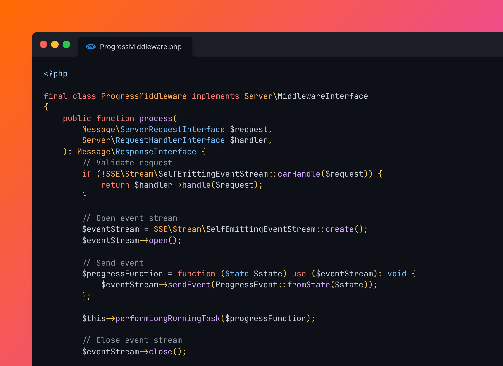

<div align="center">

[](#-installation)

# Server-Sent Events in PHP

[](https://codecov.io/gh/eliashaeussler/sse)
[](https://codeclimate.com/github/eliashaeussler/sse/maintainability)
[](https://github.com/eliashaeussler/sse/actions/workflows/cgl.yaml)
[](https://github.com/eliashaeussler/sse/actions/workflows/tests.yaml)
[](https://packagist.org/packages/eliashaeussler/sse)

</div>

A server implementation of [server-sent events][1], written in PHP.
It can be used to stream events back to the client. All event-driven
features are highly customizable, even custom emitters can be used.
The library also provides a PSR-7 compliant event stream implementation.

## 🚀 Features

* Server implementation of [server-sent events (SSE)][1]
* Highly customizable via interface implementations
* Self-emitting event stream
* PSR-7 compliant event stream

## 🔥 Installation

[](https://packagist.org/packages/eliashaeussler/sse)
[](https://packagist.org/packages/eliashaeussler/sse)

```bash
composer require eliashaeussler/sse
```

## ⚡ Usage

```php
use EliasHaeussler\SSE;

// Open event stream
$eventStream = SSE\Stream\SelfEmittingEventStream::create();
$eventStream->open();

// Send event
$eventStream->sendEvent(new MyCustomEvent($eventData));

// Send message
$eventStream->sendMessage('myCustomEvent', $eventData);

// Close event stream
$eventStream->close();
```

## 🎢 Architecture

### Event stream

All events are sent through [event streams][2]. The library provides an
interface [`Stream\EventStream`](src/Stream/EventStream.php) that abstracts
all stream parts during the whole event streaming progress.

The following event stream implementations are currently available:

* [**`Stream\SelfEmittingEventStream`**](src/Stream/SelfEmittingEventStream.php)
  sends all stream data to an [emitter](#emitter) that takes care of writing
  data into an active resource. This is the best working solution in most cases.
* [**`Stream\Psr7EventStream`**](src/Stream/Psr7EventStream.php) creates a
  PSR-7 compliant response during the whole event streaming progress. Note
  that this response is not emitted on real time.

### Emitter

All data of a self-emitting event stream is handed over to a given emitter.
The library provides an interface [`Stream\Emitter\Emitter`](src/Stream/Emitter/Emitter.php)
that takes care of all passed data.

The following emitter implementations are currently available:

* [**`Stream\Emitter\RealtimeEmitter`**](src/Stream/Emitter/RealtimeEmitter.php)
  writes all stream data directly to the active standard output.

### Event

There are two ways how data can be sent through an active event stream:

1. By sending a prebuilt event by calling `Stream\EventStream::sendEvent()`.
2. By sending a plain message by calling `Stream\EventStream::sendMessage()`.

Events can be generated by implementing the [`Event\Event`](src/Event/Event.php)
interface. Each event must provide an event name and JSON-serializable
event data.

## 🧑‍💻 Contributing

Please have a look at [`CONTRIBUTING.md`](CONTRIBUTING.md).

## ⭐ License

This project is licensed under [GNU General Public License 3.0 (or later)](LICENSE).

[1]: https://developer.mozilla.org/en-US/docs/Web/API/Server-sent_events/Using_server-sent_events
[2]: https://developer.mozilla.org/en-US/docs/Web/API/Server-sent_events/Using_server-sent_events#sending_events_from_the_server
